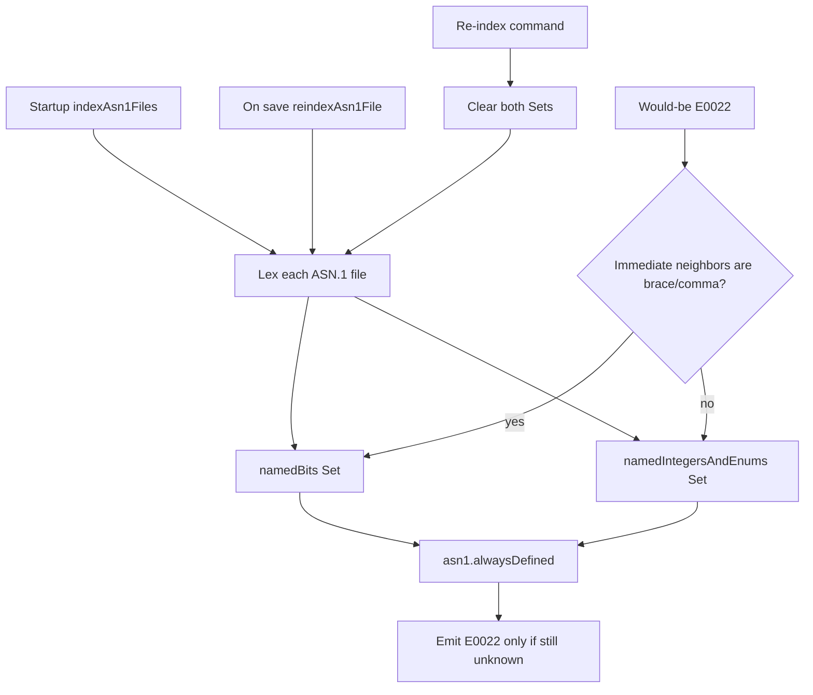

# Implicit enum, named integer, and named bit diagnostics

## Problem

`[drillForUndefinedSymbols](src/diagnostics.ts)` emits `E0022` (`DIAG_CODE_SYMBOL_NOT_DEFINED`) for any `Defined*` that is not locally assigned or imported. Same-file `ENUMERATED` items already get a pass via `definedEnumItems`, but **cross-file** variants used in information objects (for example `KIND auxiliary` against `ObjectClassKind` in `[testroot/InformationFramework.asn1](testroot/InformationFramework.asn1)`) are still flagged.

ASN.1 allows those names without import or qualification. Named bits in `{ ident, ... }` lists have the same implicit-import rule, which is why the two indexes stay separate.

## Approach

Keep the user's deliberately sloppy global whitelist: two `Set<string>`s, never shrink except when a command clears them, then rebuild.




## 1. Global indexes from the lexer

Extend `[src/indexing.ts](src/indexing.ts)` (already lexes every workspace file at startup in `[indexAsn1File](src/indexing.ts)` / `[indexAsn1Files](src/indexing.ts)`):

- Two module-level sets: `namedBits`, `namedIntegersAndEnums`.
- New function (JSDoc with `@author Cursor Grok 4.6`) that scans a token stream and **adds** names:
  - After `ENUMERATED` + `{` … `}`: every `identifier` → integers/enums set. Skip `...`, numbers, parens, comments, whitespace.
  - After `INTEGER` + `{` … `}`: same set. Ignore `INTEGER (0..MAX)` (parens, not braces).
  - After consecutive `BIT` + `STRING` + `{` … `}`: identifiers → named-bits set.
- Token types from `@wildboar/asn1-parser`: `ENUMERATED`, `INTEGER`, `BIT`, `STRING`, `identifier`, `curlyOpening`, `curlyClosing`, `comma`, plus existing ignore types `comment` / `newlineWhitespace` / `nonNewlineWhitespace`.
- Call this from `indexAsn1File` after a successful lex (same path as today's module/import index). On save, `[reindexAsn1File](src/extension.ts)` already runs, so new variants are appended. Do **not** remove names on delete/deindex.
- Export `clearNamedBitAndIntegerIndexes()` and membership helpers for diagnostics, the command, `deactivate()`, and tests.
- Nested `{ }` inside a named-number list (rare exception specs): match braces sloppily; false positives are acceptable.

## 2. Suppress E0022 using the indexes and `alwaysDefined`

In `[drillForUndefinedSymbols](src/diagnostics.ts)`, after the existing `isDefinedOrImported` / dummy-parameter / same-file enum checks fail and **before** constructing the diagnostic:

1. Decide "in curly brackets" with a **local** heuristic: after skipping whitespace, the previous char is `{` or `,` **and** the next char is `}` or `,`. That treats `{ sunday, monday }` as named bits, and leaves `KIND auxiliary` / `&kind auxiliary` on the enum/integer path (those sit inside an object `{ ... }` but are not list items).
2. If in braces: `namedBits.has(name)` → skip diagnostic.
3. Else: `namedIntegersAndEnums.has(name)` → skip diagnostic.
4. Then read `asn1.alwaysDefined` (array of strings, live from config, not cached) → skip if present.

Do not start emitting new undefined diagnostics for `IdentifierList` items that are currently skipped (`selfContainedProductions` / Setting special-case). That would change `{top}` behavior. Named-bit **uses** that already parse as `Defined`* inside `{ }` (for example actual parameters `Foo{ sunday }`) are the ones this path fixes.

## 3. Configuration, command, quick fix

**Config** in `[package.json](package.json)` `contributes.configuration`:

```json
"asn1.alwaysDefined": {
  "type": "array",
  "items": { "type": "string" },
  "default": [],
  "description": "Identifiers to always treat as defined (for example ENUMERATED variants used without import)."
}
```

Document it in `[README.md](README.md)` Configuration and note the new command / code action. Add an `[CHANGELOG.md](CHANGELOG.md)` Unreleased entry.

**Command** `asn1.reindex-implicit-symbols` (title like "Re-index ASN.1 Named Bits, Integers, and Enumerated Variants"): clear both sets, then `indexAsn1Files()`, then refresh diagnostics for open ASN.1 documents. Register in `package.json` `contributes.commands` and `[src/extension.ts](src/extension.ts)`. Call `clearNamedBitAndIntegerIndexes()` from `deactivate()` as well.

**Quick fix** in `[src/codeact.ts](src/codeact.ts)` for `DIAG_CODE_SYMBOL_NOT_DEFINED`: "Treat `name` as defined" (`CodeActionKind.QuickFix`). Command `asn1.treatAsDefined` appends the identifier to `asn1.alwaysDefined` via `ConfigurationTarget.Workspace` (fall back to `Global` if that fails) and re-runs diagnostics for the document. Same "add to dictionary" feel as existing remove-import fixes.

## 4. Tests

Add at least these (existing suite style: activate extension, `await indexingPromise`, then diagnose):

1. **Enum / named integer path** in `[src/test/diagnostics.test.ts](src/test/diagnostics.test.ts)`: untitled module that uses `KIND auxiliary` without importing `ObjectClassKind`. After workspace index (InformationFramework already defines `auxiliary`), assert no `E0022` whose range text is `auxiliary`. A truly undefined identifier in the same file should still diagnose.
2. **Named bits path**: untitled module that uses a workspace named bit **inside braces as a `Defined*`** (parameterized actual parameter is reliable, e.g. `Alias{ sunday }` after indexing `sunday` from `[testroot/SelectedAttributeTypes.asn1](testroot/SelectedAttributeTypes.asn1)`). Assert no `E0022` for `sunday`.

Also add a direct unit test of the token scanner (import `lex` + the new indexer, no UI): `ENUMERATED`/`INTEGER` names land only in the integers/enums set; `BIT STRING` names only in named bits.

Do not change the expected `E0022` count of 1 in `DiagnosticsTest.asn1`.

Every **new** function gets JSDoc including `@author Cursor Grok 4.6`.

## Testing strategy

- Run the new tests plus the existing Diagnostics and Code Actions suites (`npm test` / vscode-test).
- No browser/UI walkthrough; this is language-server-style diagnostics. Evidence is test output.
