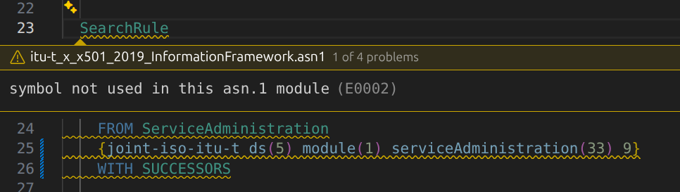
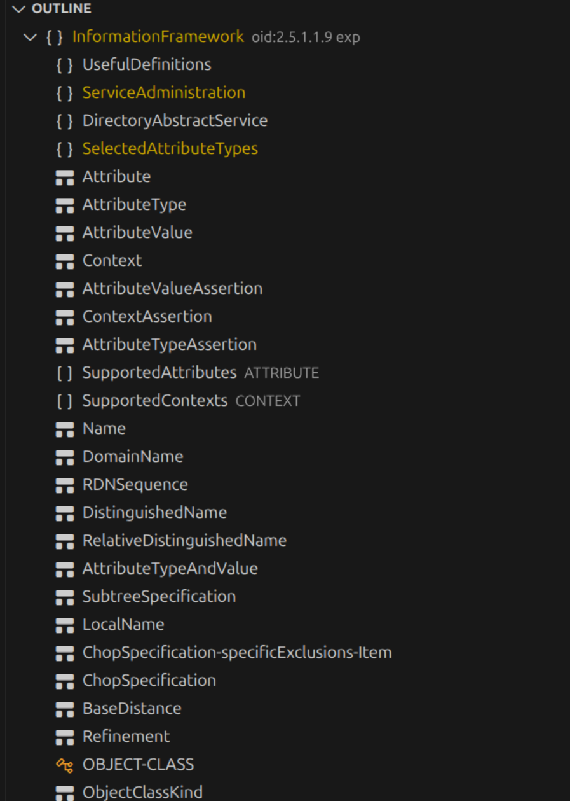
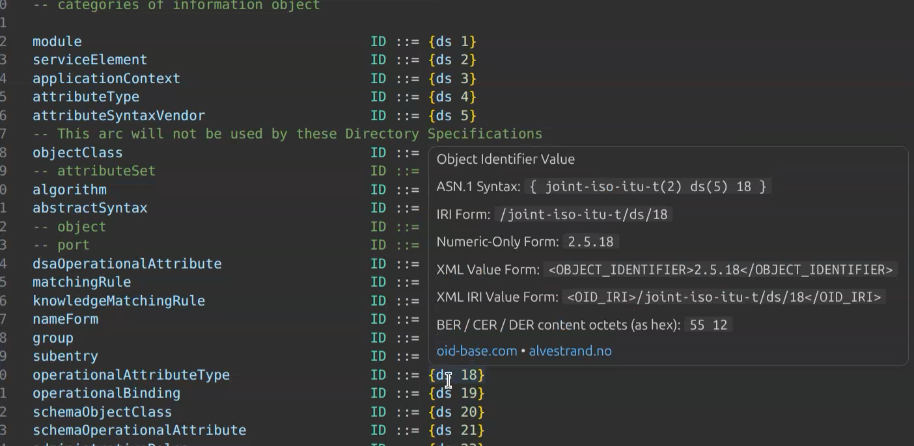
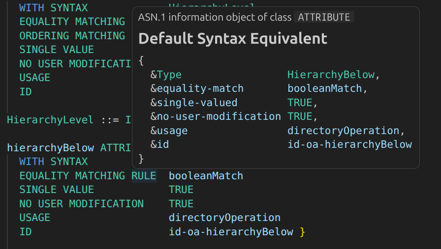

# ASN.1 VS Code Extension

It's been seven long years, but it's time for a face lift. I have updated this
extension to perform proper ASN.1 parsing using my
[`@wildboar/asn1-parser`](https://jsr.io/@wildboar/asn1-parser) module, which
will result in better quality and more features than the previous
implementation.

## Features

- Syntax Highlighting
- Bracket Completion
- Snippets
- Document Symbols (Outline) for all modules, imported modules, and assignments
- Hovers, including for ASN.1 keywords, built-in information object classes,
  such as `TYPE-IDENTIFIER` and `ABSTRACT-SYNTAX`.
- Go To Definition
- Go To Type Definition: goes to the type assignment or object class assignment
  for a given `DefinedValue` or `DefinedObject`
- Find All References
- Rename
- Folding Ranges at assignments and modules
- Code Actions: mostly just removing duplicate or unused imports
- Dropdown (not inline) Completions
- Formatting (Very conservative: basically does not touch your assignments)
- Selection Ranges
- Signature Help when you are using parameterized assignments
- Workspace Symbols
  - This only provides symbols that have appeared in a parsed file already.
  - It incrementally gets populated, instead of parsing everything upfront.
- Document Symbol Highlighting
- Diagnostics
  - Duplicate, unused, and undefined symbols, imports, exports, modules, etc.
  - Duplicate named bits, integers, `ENUMERATED` variants
  - Malformed `OBJECT IDENTIFIER`s
  - Malformed strings and time types
  - `COMPONENTS OF` referring to an invalid type
- Commands
  - Refresh ASN.1 Diagnostics
  - Export All Object Identifiers in Current File to CSV
  - Export All Object Identifiers in Entire Workspace to CSV
  - Export All ASN.1 Imports and Exports in Current File to CSV
  - Export All ASN.1 Imports and Exports in Entire Workspace to CSV
  - Export All ASN.1 Modules in Current File to CSV
  - Export All ASN.1 Modules in Entire Workspace to CSV
  - Export All ASN.1 Assignments in Current File to CSV
  - Export All ASN.1 Assignments in Entire Workspace to CSV
  - Export All ASN.1 Modules in Current File to JSON
- Language Model (LM) Tools
  - `asn1_get_imports`
  - `asn1_get_exported_symbols`
  - `asn1_get_assignments`
  - `asn1_get_modules`
  - `asn1_get_object_identifiers`

The few remaining features that were not implemented were intentional: deemed
to be low value or non-sensical. The features that were implemented are often
imperfect.

## Non-Features

This VS code extension does **NOT**:

- Completely validate your ASN.1 at a semantic level
- Check that values match types and vice versa
- Ensure valid defined syntax in information object assigments
- Ensure valid field names in information object assignments
- Validate Encoding Control Notation (ECN)
- Validate that all imported symbols exist in the modules from whence they are imported
- Perform perfectly thorough date and time validation: validation is "good
  enough" and can miss some mistakes

Part of these shortcomings owe to deficiencies in my `@wildboar/asn1-parser`
module (though its pretty good now, I had no experience writing parsers or any
kind of language validation before). I cannot realistically improve upon this
much other than by spending several months re-writing module (`P4 / WONTFIX`).

There are probably other shortcomings I haven't listed above. I welcome PRs
that aren't entirely AI slop.

## Screenshots






## Quality Issues

You may encounter quality issues in the following scenarios:

- Usage of `XMLValueAssignment`: this is not tested at all, in part because it
  so rarely used. I have a "database" of about 2000 published ASN.1 modules,
  and _none_ use XML value assignments, so I don't even have authoritative
  examples to validate my implementation with.
- The language model tools have not been tested at all. It's pretty simple
  code, so I think its correctly implemented, but I don't know how well it
  will actually work when used with vibe-coding.

## Configuration

Here are the configuration options:

```json
{
  "asn1.includeFiles": {
    "type": "string",
    "default": "**/*.{asn,asn1}",
    "description": "Glob matching ASN.1 files in this workspace."
  },
  "asn1.excludeFiles": {
    "type": "string",
    "default": "**/{node_modules,dist,out,build,.git}/**",
    "description": "Glob matching ASN.1 files in this workspace."
  },
  "asn1.enableDiagnostics": {
    "type": "boolean",
    "default": true,
    "description": "Enable diagnostics for ASN.1 files."
  },
  "asn1.strictModuleOidMatch": {
    "type": "boolean",
    "default": true,
    "description": "Match modules strictly, by OID, respecting WITH SUCCESSORS and WITH DESCENDANTS. If false, modules are only matched by name."
  },
  "asn1.maxLineLength": {
    "type": "number",
    "minimum": 1,
    "description": "Maximum preferred line length, used in formatting"
  },
  "asn1.exportEndOfLine": {
    "type": "string",
    "enum": [
      "lf",
      "crlf"
    ],
    "description": "Line endings for CSV exports. Defaults to the line endings of the source ASN.1 file."
  }
}
```

## Snippets

Here are the snippets:

- `seq`: create a `SEQUENCE`
- `set`: create a `SET`
- `setof`: create a `SET OF`
- `seqof`: create a `SEQUENCE OF`
- `cho`: create a `CHOICE`
- `oid`: create an `OBJECT IDENTIFIER`

There are a few others, but not that you are likely to use them.

## Disabling Diagnostics

It can be annoying to get diagnostics for an ASN.1 file that you are in the
process of editing, because it might be invalid until it is done, and repeatedly
analyzing it for diagnostics wastes computing power and creates visual clutter
with all of the "squiggles." To disable diagnostics, add a comment to the top of your
ASN.1 file that starts with `no_diagnose`, such as `-- no_diagnose` or
`/* no_diagnose */`. This will only have an effect if it is on the first line.

If this special comment is present, it will be a lone warning diagnostic for
the file, just to remind you that you have otherwise disabled diagnostics.

You can also globally disable diagnostics by setting `enableDiagnostics` to
`false`.

## Versioning

In this project, a major version change (breaking change) means any change that
(knowingly):

- Makes a user's existing configuration not work as expected
- Removes a column from CSV export formats
- Adds a column to CSV export formats anywhere other than at the end
- Removes or renames fields used in JSON exports

The above is what is considered "breaking" for versioning purposes.

## Performance

This seems to perform reasonably well. Even in a workspace with over 1500
modules, it manages to index them in about seven to twenty seconds.

This was not implemented as an LSP server. The parser was already written in
TypeScript, so its going to be slower than a compiled language, but it has
the benefit of being able to run directly in VS code's memory, so there is
no overhead of IPC to incur.

## AI / LLM Usage Statement

Almost none of the code in this repository was written AI / LLMs, except a few
tests and a few small functions. The vast majority of it was written by yours
truly.

## Command Output Samples

You can see samples of the outputs of the CSV export commands in the
`sample-exports` folder.

- [`assignments.csv`](./sample-exports/assignments.csv)
- [`imports-exports.csv`](./sample-exports/imports-exports.csv)
- [`modules.csv`](./sample-exports/modules.csv)
- [`oids.csv`](./sample-exports/oids.csv)

## Future To Dos

- [ ] Inline completions
  - I remove this entirely because it sucks. Probably my implementation, but
    also VS code's handling of it. It seems so buggy I don't know how this
    ever worked for GitHub Copilot, and I hate that there's now code that
    runs on every key stroke. There is also no API for invoking the inline
    completions, still, after this feature has been out for four years. So
    I cannot even write unit tests for it. This will have to wait.
- [ ] Only suggest suitable types after `COMPONENTS OF`
- [ ] Propose merging duplicate modules
- [ ] Export X.500 Information Objects? (Support LDIF as well)
  - I am taking a break from this. It's just way too complicated for something I'll want as a one-off.
- [ ] Show production type on hover?
- [ ] Export Information Objects to JSON (translates to defined syntax)
- [ ] Warnings
  - [ ] (MIN..MAX) unnecessary
  - [ ] GeneralString use is discouraged (Page 182 Dubuisson)
  - [ ] GraphicString use is discouraged (Page 182 Dubuisson)
- [ ] Errors
  - [ ] Constraints
    - [ ] Cannot have negative SIZE
    - [ ] No leading 0 on SIZE constraint
    - [ ] Make sure SIZE is only applied to types that support it
    - [ ] Range boundaries: minimum greater than maximum in SIZE
    - [ ] Range boundaries: minimum greater than maximum
    - [ ] Leading or Trailing "|" Alternation Operator in FROM
    - [ ] FROM range cannot span multi-character strings
    - [ ] PATTERN validation
  - [ ] Leading zeros in numeric literal (X.680 S 12.8)

Note: it appears that there is no way to programmatically obtain inline
completions, so this is not going to have unit tests for now.
